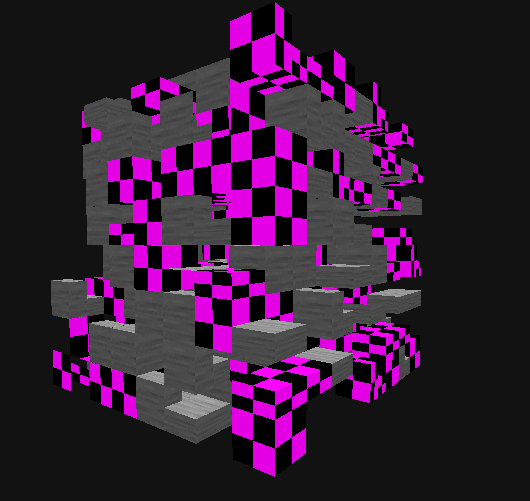

# webmc

After decompiling and deobfuscating Minecraft java 1.14.4, 
I realized it would be easier to recreate instead of mod. 
This is the result of that realization.

## Libraries
- three and @types/three for base webgl renderer

# In House Libraries
- @repcomm/gameinput-ts for dynamic user input
- @repcomm/three.lookcamera for demo freecamera
- @repcomm/exponent-ts for UI library

## Implemented
- WebGL renderer
- World
- Chunk
